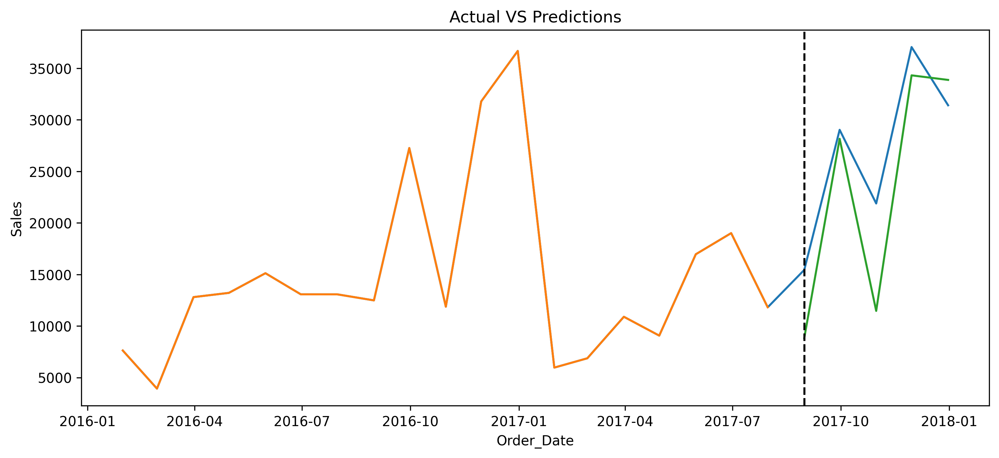
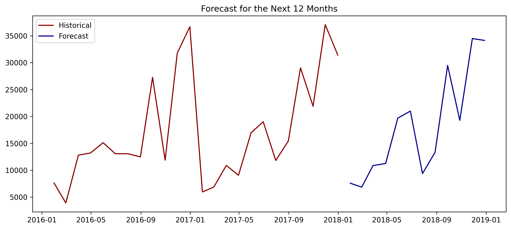
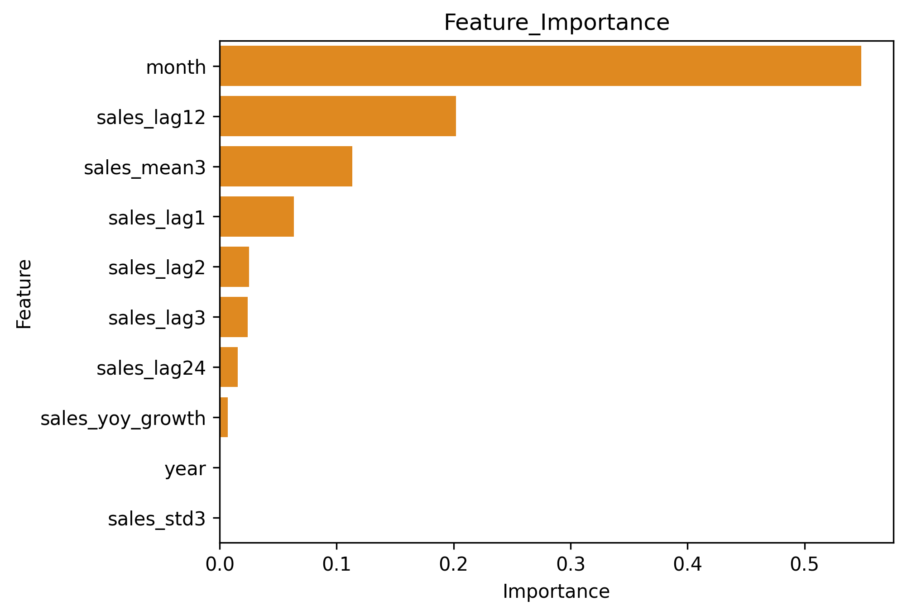

# Retail-Sales-Monthly-Forecasting-XGBoost.
Monthly retail sales forecasting using XGBoost and time-series features.

Retail Sales Forecasting with XGBoost

Overview

This project forecasts monthly retail sales using XGBoost and historical sales patterns.

Methodology

* Aggregated transaction-level sales into monthly sales
* Created lagged and rolling time-series features
* Used a chronological train-test split
* Trained an XGBoost regression model
* Evaluated performance using R², MAE, and RMSE
* Generated a 12-month recursive forecast

Key Finding

The model achieved an R² of approximately 41% on the test set. Feature importance showed that month and sales_lag12 were the strongest predictors, indicating a strong seasonal pattern in retail sales.

Tools
Python • Pandas • NumPy • Matplotlib • Scikit-learn • XGBoost • Jupyter Notebook

## Forecast Visualizations

## Forecast Visualizations

![Feature Importance](feature_importance.png
